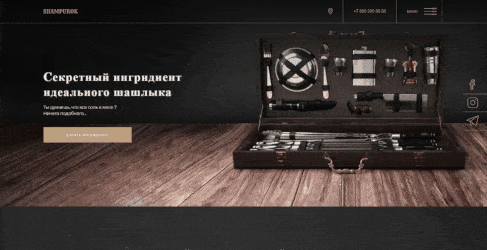

<h1><a href='https://shampurok.netlify.app'>SHAMPUROK - Адаптивный Лендинг Сайт</a></h1>

 

### О проекте

Шампурок - это креативный адаптивный лендинг сайт с впечатляющими анимациями, параллаксом и модальными окнами.

### Особенности

- **Адаптивный дизайн**: Шампурок адаптирован под все типы устройств, что делает его доступным для пользователей как на
  десктопе, так и на мобильных устройствах.

- **Лендинг страница с анимациями**: анимации придают сайту живость и динамику.

- **Параллакс эффект**: Используя библиотеку rellax, добавлен параллакс эффект, который придает сайту глубину и
  интересный визуальный опыт.

- **Модальные окна**: Модальные окна делают взаимодействие пользователя с сайтом более комфортным и информативным.

### Используемые библиотеки

Для создания сайта "Шампурок" мы использовали следующие библиотеки:

- [**swiper**](https://www.npmjs.com/package/swiper) ^6.7.0
- [**Rellax**](https://www.npmjs.com/package/rellax) ^1.12.1
- [**simplebar**](https://www.npmjs.com/package/simplebar) ^5.3.3
- [**fittext**](https://www.npmjs.com/package/fittext) ^2.4.0

# License

Distributed under the `MIT` License. See [LICENSE](https://github.com/kluevevga/shampurok/blob/master/LICENSE) for more
information.

